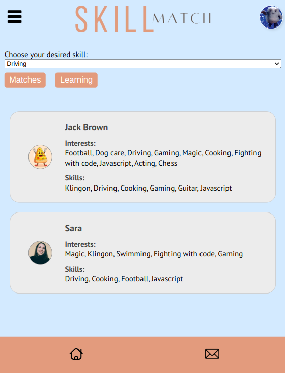

<!-- PROJECT LOGO -->
<div align="center">
    
</div>

## About SkillMatch

<div align="center">
   
</div>

<br>

Introducing SkillMatch, a web-based app that provides a platform for connecting learners and teachers. With SkillMatch, you can create a personalised profile, list the interests you want to explore, and showcase the skills you're ready to teach. Our search tool helps you find the perfect match for learning or teaching. You can easily discuss and arrange learning sessions with our live chat feature.

### Built With

- [![React][React.js]][React-url]
- [![Node][Node.js]][Node-url]
- [![Supabase][Supabase]][Supabase-url]

## Brief Project Insight & Members

This full-stack project was planned, designed and developed in just 8 days during the final project phase at the Northcoders Software Development bootcamp.

| **Name**         | **Links**                                                                                                            |
| ---------------- | -------------------------------------------------------------------------------------------------------------------- |
| Dorota Szubert   | [LinkedIn](https://www.linkedin.com/in/dorota-szubert-333545239/) \| [Github](https://github.com/DeeSzubert)         |
| Fabian Fernandez | [LinkedIn](https://www.linkedin.com/in/fabian-fernandez-a2b67818/) \| [GitHub](https://github.com/FabianFernandezM/) |
| Jack Brown       | [LinkedIn](https://www.linkedin.com/in/jack-brown-ab2a84286/) \| [GitHub](https://github.com/ClaretJack/)            |
| Muhammad Sallu   | [LinkedIn](https://www.linkedin.com/in/muhammad-sallu/) \| [GitHub](https://github.com/MuhammadSallu)                |
| Sara Matos       | [LinkedIn](https://www.linkedin.com/in/saragmatos/) \| [GitHub](https://github.com/SaraGMatos/)                      |

## Getting Started

To get started with SkillMatch, the hosted version of our web-based app can be found at: [https://skillmatched.netlify.app/](https://skillmatched.netlify.app/). After creating an account and setting up a profile, you're good to go finding a learning or teaching partner!

## Features

Users can:

- Sign up with a new account/sign in with an existing account.
- Modify User Profile by changing profile pic, adding skills you can teach and interests you can learn.
- View matches to exchange teaching and learning skills with one another.
- View learning opportunities with another user to learn a new skill.
- Filter matches and learning opportunities by skill.
- Connect to another user by username.

## How to Run Locally

1. **Node Installation**

- Ensure you have Node.js version 21 or higher installed on your system. If you do not have it installed, please follow the instructions [here](https://nodejs.org/en/learn/getting-started/how-to-install-nodejs).

2. **Clone the repository**

- Download the project files by copying and running the following command:

```sh
  git clone https://github.com/SaraGMatos/skillmatch.git
```

3. **Install Dependencies**

- Navigate to the project directory and run `npm install` to install the required packages and dependencies.

4. **Supabase Account and Project**

- Create a Supabase account and a new project. Note down the project url and api key.

5. **Env File Creation**

- Navigate to /skillmatch/client/ and create a .env file containing the following variables:

```sh
VITE_REACT_APP_SUPABASE_URL=https://your_project_url.supabase.co
VITE_REACT_APP_SUPABASE_KEY=your_api_key
```

6. **Authentication Setup**

- In Supabase, navigate to the "Authentication" section within the dashboard to configure settings enabling user login via email.

7. **Creating Tables**

- In Supabase, navigate to the "Table Editor" section and create these tables:

`Users Table`

| user_id     | time_created | username | avatar_url | description | showcase |
| ----------- | ------------ | -------- | ---------- | ----------- | -------- |
| Primary Key | Timestamptz  | Varchar  | Text       | Text        | Text     |

`Chats Table`

| chat_id     | chat_name |
| ----------- | --------- |
| Primary Key | Text      |

`Messages Table`

| message_id  | time_created | author                       | message | chat_id                      |
| ----------- | ------------ | ---------------------------- | ------- | ---------------------------- |
| Primary Key | Timestamptz  | Foreign Key to Users.user_id | Text    | Foreign Key to Chats.chat_id |

`Reviews Table`

| review_id   | time_created | reviewer_id                  | reviewee_id                  | message | rate |
| ----------- | ------------ | ---------------------------- | ---------------------------- | ------- | ---- |
| Primary Key | Timestamptz  | Foreign Key to Users.user_id | Foreign Key to Users.user_id | Text    | Int2 |

`Skills Table`

| skill_id    | skill_name | description |
| ----------- | ---------- | ----------- |
| Primary Key | Varchar    | Text        |

`UserChats Table`

| user_chats_id | chat_id                      | user_id                      |
| ------------- | ---------------------------- | ---------------------------- |
| Primary Key   | Foreign Key to Chats.chat_id | Foreign Key to Users.user_id |

`UserSkills Table`

| user_skills_id | user_id                      | skill_id                       |
| -------------- | ---------------------------- | ------------------------------ |
| Primary Key    | Foreign Key to Users.user_id | Foreign Key to Skills.skill_id |

`UserInterests Table`

| user_interests_id | user_id                      | skill_id                       |
| ----------------- | ---------------------------- | ------------------------------ |
| Primary Key       | Foreign Key to Users.user_id | Foreign Key to Skills.skill_id |

<br>

8. **Creating Functions**

- In order for this project to run correctly, there are Supabase functions that need creating by navigating to the "Database" section, then to the Functions section and clicking "Create New Function". The included doc [here](./documentation/functions.md) will contain the name and corresponding code for each function needed.

9. **Running the project**

- Run the following commands to start the project:

```sh
cd client
```

```sh
npm run dev
```

10. **Signing In**

- Sign up to create an account and you're good to go!

## Contributions

This project is open to contributions. Feel free to submit a pull request if you would like to make a suggestion or raise an issue or problem with the code.

## Acknowledgments

- [UseLottie](https://lottiereact.com/)
- [Socket.io](https://socket.io)

[product-screenshot]: ./documentation/SkillMatch_screenshot.png
[Node.js]: https://img.shields.io/badge/Node.JS-20232A?style=for-the-badge&logo=node.js&logoColor=61DAFB
[Node-url]: https://nodejs.org/
[React.js]: https://img.shields.io/badge/React-20232A?style=for-the-badge&logo=react&logoColor=61DAFB
[React-url]: https://reactjs.org/
[Supabase]: https://img.shields.io/badge/Supabase-20232A?style=for-the-badge&logo=supabase&logoColor=61DAFB
[Supabase-url]: https://supabase.com


