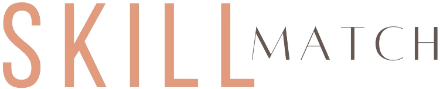

<!-- PROJECT LOGO -->

    

<!-- ABOUT THE PROJECT -->

## About SkillMatch

<!-- [![SkillMatch screenshot][product-screenshot]](https://skillmatched.netlify.app/) -->

   

 

Introducing SkillMatch, a web-based app that provides a platform for connecting learners and teachers. With SkillMatch, you can create a personalised profile, list the interests you want to explore, and showcase the skills you're ready to teach. Our search tool helps you find the perfect match for learning or teaching. You can easily discuss and arrange learning sessions with our live chat feature.

### Built With

- [![React][React.js]][React-url]
- [![Node][Node.js]][Node-url]
- [![Supabase][Supabase]][Supabase-url]

## Getting Started

To get started with SkillMatch, the hosted version of our web-based app can be found at: [https://skillmatched.netlify.app/](https://skillmatched.netlify.app/). After creating an account and setting up a profile, you're good to go finding a learning or teaching partner!

## Features

Users can:

- Sign up with a new account/sign in with an existing account.
- Modify User Profile by changing profile pic, adding skills you can teach and interests you can learn.
- View matches to exchange teaching and learning skills with one another.
- View learning opportunities with another user to learn a new skill.
- Filter matches and learning opportunities by skill.
- Connect to another user by username.

### Project Members

| **Name**         | **Links**                                                                                                            |
| ---------------- | -------------------------------------------------------------------------------------------------------------------- |
| Dorota Szubert   | [LinkedIn](https://www.linkedin.com/in/dorota-szubert-333545239/) \| [Github](https://github.com/DeeSzubert)         |
| Fabian Fernandez | [LinkedIn](https://www.linkedin.com/in/fabian-fernandez-a2b67818/) \| [GitHub](https://github.com/FabianFernandezM/) |
| Jack Brown       | [LinkedIn](https://www.linkedin.com/in/jack-brown-ab2a84286/) \| [GitHub](https://github.com/ClaretJack/)            |
| Muhammad Sallu   | [LinkedIn](https://www.linkedin.com/in/muhammad-sallu/) \| [GitHub](https://github.com/MuhammadSallu)                |
| Sara Matos       | [LinkedIn](https://www.linkedin.com/in/saragmatos/) \| [GitHub](https://github.com/SaraGMatos/)                      |

## Acknowledgments

- [UseLottie](https://lottiereact.com/)
- [Socket.io](https://socket.io)

[product-screenshot]: ./documentation/SkillMatch_screenshot.png
[Node.js]: https://img.shields.io/badge/Node.JS-20232A?style=for-the-badge&logo=node.js&logoColor=61DAFB
[Node-url]: https://nodejs.org/
[React.js]: https://img.shields.io/badge/React-20232A?style=for-the-badge&logo=react&logoColor=61DAFB
[React-url]: https://reactjs.org/
[Supabase]: https://img.shields.io/badge/Supabase-20232A?style=for-the-badge&logo=supabase&logoColor=61DAFB
[Supabase-url]: https://supabase.com
